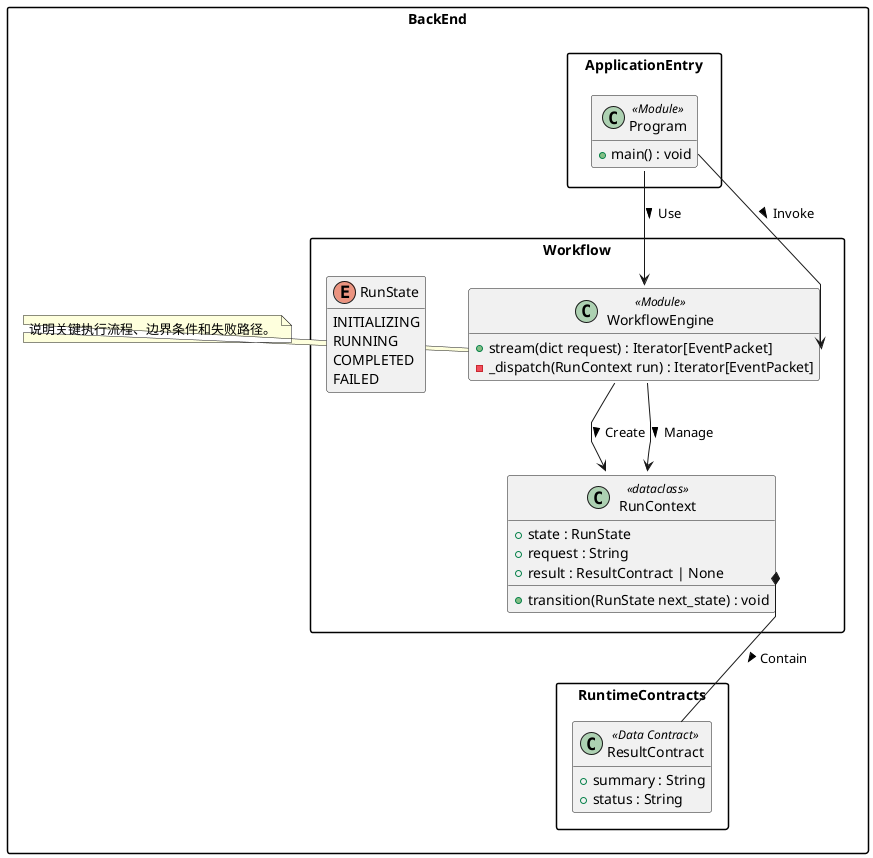

# UML 绘制习惯与规范

> 本文根据现有 PlantUML 图的结构、命名、关系表达和注释方式，总结个人偏好的 UML 绘制习惯。它既是风格说明，也可以作为后续绘制代码架构图时的执行规范。

---

## 1. 总体定位

我的 UML 不是传统意义上只描述面向对象继承关系的“纯类图”，而是一个以类图语法承载的**代码架构总览图**。

它需要同时回答以下问题：

1. 项目由哪些源码领域、模块和子系统组成？
2. 每个模块内部有哪些重要字段、常量、函数和运行时对象？
3. 请求、数据和控制权如何在模块之间流转？
4. 哪些结构是真实类，哪些是模块、数据契约、数据库表或外部系统？
5. 核心业务流程为什么这样设计？
6. 代码中的关键约束、阻塞点和生命周期是什么？

因此，图的目标不是追求最少元素，而是尽可能在一张图中保存足够多的代码语义，使读者不打开源码也能理解系统的主要结构。

---

## 2. 核心绘图原则

### 2.1 以代码事实为基础

图中的实体、字段、方法和关系应能在代码中找到依据。

- 不为了图形对称而虚构类。
- 不把推测性的职责画成已经存在的实现。
- 对运行时通过 `dict` 传递的数据，可以抽象为数据契约，但必须明确标注为 `<<Data Contract>>`。
- 对 Python 文件级函数集合，可以使用类框表示，但必须标注为 `<<Module>>`，避免误解为真实 Python 类。
- 真实的 `dataclass`、`enum`、异常类和继承关系应按源码中的实际类型表示。

### 2.2 优先呈现架构职责，而不局限于 OO 关系

只画继承、组合和聚合不足以表达实际系统。

图中应同时表达：

- 模块调用；
- 状态分发；
- 数据传递；
- 工具注册；
- 依赖注入；
- 数据持久化；
- 阶段交接；
- 外部系统接入；
- 文件、数据库和运行时状态之间的联系。

### 2.3 一张总图优先

倾向于绘制一张覆盖整个后端或整个目标范围的总图，而不是把同一系统拆成很多彼此割裂的小图。

总图可以很大，但必须通过以下方式维持可读性：

- 按源码领域分包；
- 使用明确的 stereotype；
- 只保留重要成员；
- 关系使用统一动词；
- 关键路径集中布局；
- 通过 note 补充流程，而不是把所有解释都塞入关系标签。

---

## 3. 包与层级组织习惯

### 3.1 使用一个总范围包

最外层使用一个代表当前分析范围的总包，例如：

```plantuml
package BackEnd {
    ...
}
```

它用于明确图的边界，避免把未分析的前端、基础设施或外部平台误认为已经包含在内。

### 3.2 按源码领域划分子包

子包不是机械对应每个目录，而是依据职责形成可理解的领域分区。

常见分区包括：

- `ApplicationEntry`：程序入口与桌面容器；
- `HTTPServer`：路由、请求处理和流式响应；
- `Workflow`：总状态机和各阶段 handler；
- `RuntimeContracts`：阶段之间传递的数据结构；
- `TaskAnalysisAndTracking`：任务分析、契约和任务项；
- `Investigation`：调查循环、工具调用和发现记录；
- `Planning`：设计规划与 patch planning；
- `ImplementationAndValidation`：实施与验证；
- `PatchSubsystem`：授权、快照、事务写入和回滚；
- `EvidenceSubsystem`：证据、判断和假设验证；
- `ToolSystem`：工具定义、注册和内置工具；
- `MCP`、`LSP`、`SubAgentSystem`：扩展能力；
- `ModelAndPromptRuntime`：模型调用、provider 和 prompt；
- `Persistence`：SQLite、session、workspace 和配置持久化。

### 3.3 包名使用架构概念，而不是随意缩写

包名应能直接说明职责。除非是行业内约定名称，例如 `MCP`、`LSP`、`HTTP`，否则不使用难以理解的缩写。

---

## 4. 实体建模习惯

### 4.1 Python 模块使用 `<<Module>>`

对于主要由常量和模块级函数组成的 `.py` 文件，使用类框表示其公开结构：

```plantuml
class Chat <<Module>> {
    - _CHAT_TRANSITIONS : dict[ChatState,set[ChatState]]
    + stream(dict request, String workspace_dir=".") : Iterator[EventPacket]
    - _chat_events(ChatRun run) : Iterator[EventPacket]
}
```

目的不是声称源码中存在 `Chat` 类，而是让模块职责、成员和调用关系能够进入统一的类图语法。

### 4.2 真实数据类保留实际类型

真实 `dataclass` 应标记其实际性质：

```plantuml
class ChatRun <<dataclass>>
class Evidence <<dataclass, slots>>
class FileSnapshot <<dataclass, frozen>>
```

如果 `slots`、`frozen` 会影响生命周期、可变性或性能语义，应明确保留。

### 4.3 运行时字典使用 `<<Data Contract>>`

阶段之间用字典传递但具有稳定字段结构的数据，抽象为数据契约：

```plantuml
class InvestigationResult <<Data Contract>> {
    + summary : String
    + beliefs : list[BeliefRecord]
    + resolutions : list[ResolutionRecord]
    + ready_for_patch_planning : bool
}
```

这类实体强调“数据形状”和“阶段接口”，不是源码中的实例化类。

### 4.4 记录型结构使用 `<<Data Record>>`

单条观察、知识、resolution 或 session 记录等，使用 `<<Data Record>>`。

它们通常是某个更大契约中的列表元素。

### 4.5 数据库表使用 `<<SQLite Table>>`

数据库结构直接以表实体表示，保留：

- 主键 `PK`；
- 外键 `FK`；
- 唯一约束 `UNIQUE`；
- 重要字段类型；
- JSON 存储字段。

例如：

```plantuml
class SessionsTable <<SQLite Table>> {
    + id INTEGER PK
    + workspace_id INTEGER FK
    + state_json TEXT
    + usage_json TEXT
}
```

数据库表与业务模块通过 `Persist` 相连，表与表之间通过 `Foreign Key` 相连。

### 4.6 外部依赖明确标为 `<<External>>`

例如 WebView、Vite、OpenAI-compatible API 或操作系统能力。

这样可以快速区分：

- 项目自己控制的代码；
- 标准库或父类；
- 外部程序、服务和框架。

### 4.7 注册表、工具和异常使用专门 stereotype

常用类型包括：

- `<<Registry>>`：运行时注册表；
- `<<ToolDef>>`：可调用工具定义；
- `<<Control Tool>>`：控制 agent 流程的特殊工具；
- `<<Exception>>`：具有业务错误码的异常；
- `<<Static Data>>`：路由表等静态声明；
- `<<Runtime Object>>`：仅存在于运行期的控制对象；
- `<<File Journal>>`：事务和回滚日志结构。

stereotype 的目的，是弥补类图外形相似造成的语义混淆。

---

## 5. 成员与签名表达习惯

### 5.1 保留可见性

沿用 UML 可见性符号：

- `+`：公开或对外使用；
- `-`：模块内部、私有或实现细节。

即便 Python 的私有性只是命名约定，也保留 `_name` 与 `-` 的双重表达，以强化阅读效果。

### 5.2 字段写出类型和重要默认值

格式：

```text
可见性 字段名 : 类型 = 默认值
```

只保留对架构或运行逻辑有意义的默认值，例如：

- 最大轮数；
- 超时时间；
- 文件大小限制；
- 状态初值；
- 是否启用 daemon thread；
- 工具集合；
- TTL。

普通局部变量不进入图中。

### 5.3 方法尽量保留完整签名

格式：

```text
可见性 方法名(参数名 : 类型, ...) : 返回类型
```

在不造成极端冗长的前提下，保留：

- 参数名称；
- 关键参数类型；
- 可选值或默认值；
- 返回类型；
- generator、iterator、async 工具等运行特征。

### 5.4 重要内部函数也要画

不会只画 public API。若内部函数决定了：

- 状态迁移；
- 校验；
- 规范化；
- 数据合并；
- 安全边界；
- 重试与恢复；
- 工具选择；

即使以 `_` 开头，也应进入图中。

### 5.5 不机械列出全部源码成员

成员选择以“理解架构是否需要”为标准。

应省略：

- 纯格式化辅助函数；
- 无独立职责的简单 getter；
- 大量重复的字段转换；
- 与主流程无关的测试辅助代码；
- 只为语法便利存在的微小 wrapper。

---

## 6. 关系表达习惯

### 6.1 每条重要关系使用明确动词

不满足于一根无标签箭头。关系标签要说明行为语义。

常用标签如下：

| 标签 | 含义 | 典型场景 |
|---|---|---|
| `Invoke >` | 调用方法或函数 | Handler 调用 Chat.stream |
| `Use >` | 依赖或读取某模块能力 | Planner 使用 PromptRuntime |
| `Create >` | 创建实例、server、授权或记录 | Server 创建 Handler |
| `Register >` | 注册 handler、tool 或 runtime capability | ToolRegistry 注册 ToolDef |
| `Contain >` | 对象或契约包含子结构 | ChatRun 包含 TaskAnalysis |
| `Persist >` | 将状态写入某张表 | Sessions 持久化到 SessionsTable |
| `Handoff >` | 一个阶段将结果交给下一阶段 | Investigator 交给 DesignPlanner |
| `Dispatch >` | 根据状态或名称分发到处理器 | ChatRun 分发到状态 handler |
| `Inject <` | 注入依赖或回调对象 | WebView 注入 Api |
| `Extend >` | 继承 | Handler 继承 HTTP handler |
| `Discover >` | 动态发现模块或工具 | BuiltinTools 扫描 TOOL |
| `Sync >` | 同步外部注册表或状态 | LSP 同步 Mason registry |
| `Install >` | 安装扩展组件 | Subagent 安装 MCP server |
| `Request >` | 发起网络或模型请求 | AgentRuntime 请求 provider |
| `Throw >` | 抛出业务异常 | PatchEngine 抛出 PatchError |
| `Foreign Key >` | 数据库外键 | SessionsTable 指向 WorkspacesTable |

### 6.2 调用关系优先精确到成员级

当具体方法非常关键时，关系端点写到成员，而不是只连接两个类：

```plantuml
Handler::_handle_chat --> Chat::stream : Invoke >
Program::main --> Server::create : Invoke >
```

这样可以直接呈现真实调用入口，减少“模块 A 与模块 B 有关系，但不知道哪里发生”的模糊性。

### 6.3 数据包含使用组合关系

稳定的所有权或字段包含关系使用：

```plantuml
ChatRun::analysis *-- TaskAnalysis : Contain >
SessionState::taskItems *-- TaskItem : Contain >
```

这类箭头表示数据结构上的包含，不一定意味着 Python 对象生命周期上的严格 UML composition。

因此，图中 `*--` 更接近“结构性包含”的语义。

### 6.4 普通依赖和执行流使用定向箭头

大多数调用和数据流使用：

```plantuml
A --> B : Invoke >
```

偏好明确方向，而不是无方向关联。

### 6.5 继承关系只用于真实继承

只有源码确实存在继承关系时使用：

```plantuml
Handler --|> SimpleHTTPRequestHandler : Extend >
```

不会用继承箭头表达“包装”“调用”或“职责相似”。

### 6.6 阶段之间使用 `Handoff`，而不是全部写成 `Invoke`

如果关系的重点是前一阶段产出结构化结果，并将控制权交给下一阶段，应使用 `Handoff`。

这能区分：

- 普通函数调用；
- 工作流阶段交接；
- 数据所有权转移。

---

## 7. 注释与说明习惯

### 7.1 关键方法旁添加中文 note

note 不是重复方法名，而是解释源码仅靠签名无法直接表达的设计含义。

适合写 note 的位置包括：

- 启动流程；
- 流式请求生命周期；
- 状态机异常处理；
- 调查循环和批次约束；
- patch 授权边界；
- 快照和 stale check；
- 数据持久化范围；
- 阻塞等待和线程行为；
- fallback 与恢复路径。

### 7.2 note 优先放在具体成员旁

例如：

```plantuml
note right of Handler::_handle_chat
    /api/chat 使用 NDJSON 流式响应。
    当前请求线程会同步遍历 Chat.stream()。
end note
```

比起把说明挂在整个模块旁，更倾向于准确绑定到产生该行为的方法。

### 7.3 流程说明使用编号

涉及连续步骤时使用数字列表：

```text
1. 构建前端
2. 初始化 workspace
3. 创建 HTTP server
4. 启动后台线程
5. 打开 WebView
```

这样 note 可以承担轻量级顺序图的作用。

### 7.4 note 既描述正常流程，也描述风险和限制

图不是宣传图。发现架构限制时应直接写出，例如：

- 请求线程会被同步阻塞；
- 等待没有 timeout；
- session 只保存 investigation memory；
- 某些恢复分支不会持久化；
- 某状态迁移在实际代码中不闭合。

这种注释有助于让图同时承担架构审计作用。

### 7.5 中文解释，代码标识保持原文

说明文字使用中文，但以下内容不翻译：

- 类名；
- 模块名；
- 方法名；
- 字段名；
- enum 值；
- API path；
- tool name；
- 状态值；
- 数据库字段。

---

## 8. 布局与视觉习惯

### 8.1 使用矩形 package

```plantuml
skinparam packageStyle rectangle
```

矩形包更接近代码模块和架构边界，不使用文件夹标签式 package。

### 8.2 使用折线关系

```plantuml
skinparam linetype polyline
```

适合大型总图，减少大量曲线造成的视觉噪声。

### 8.3 隐藏空成员区

```plantuml
hide empty members
```

没有字段或方法的实体不保留无意义空白区域。

### 8.4 默认依赖 PlantUML 自动布局，但对主链进行人工约束

大多数包内部交给 PlantUML 自动排列；对全局主链使用 `together` 或额外关系约束，使核心流程靠近：

```plantuml
together {
    Handler --> Chat : Use >
    Chat --> ChatRun : Manage >
    ChatRun --> Investigator : Dispatch >
    Investigator --> DesignPlanner : Handoff >
    DesignPlanner --> PatchPlanner : Handoff >
    PatchPlanner --> ImplementationRunner : Handoff >
}
```

### 8.5 note 以右侧为主，左侧为辅

通常使用：

```plantuml
note right of ...
```

当右侧空间拥挤或需要平衡布局时，才使用左侧 note。

### 8.6 不依赖颜色区分语义

当前风格主要依靠以下方式建立层次：

- package；
- stereotype；
- 成员签名；
- 箭头类型；
- 关系标签；
- note。

颜色不是必要条件，保证黑白导出和大图缩放后仍可阅读。

---

## 9. 信息密度偏好

### 9.1 接受高密度，但反对无组织的堆积

高密度本身不是问题，只要每个实体都属于明确分区，关系标签稳定，主流程清楚。

### 9.2 关键模块展开，次要模块压缩

核心流程中的模块应详细列出重要成员，例如：

- `ChatRun`；
- `Investigator`；
- `DesignPlanner`；
- `PatchPlanner`；
- `ImplementationRunner`；
- `PatchEngine`；
- `PatchAuthorization`；
- `AgentRuntime`。

外围模块只保留核心 API，例如：

- 外部框架；
- 简单 provider getter；
- 辅助安装器；
- 低层格式化工具。

### 9.3 数据链路必须完整

即使图较大，也应尽量完整画出：

```text
用户请求
→ HTTP Handler
→ Chat 状态机
→ TaskAnalysis
→ InvestigationResult
→ DesignPlan
→ PatchPlan
→ ExecutionAuthorization
→ ImplementationResult
→ ValidationResult
→ Session / SQLite
```

不能只画控制器而省略阶段之间真正传递的数据契约。

---

## 10. 推荐绘制流程

### 第一步：确定图的范围

明确本次图覆盖：

- 整个后端；
- 某个 commit 的最终状态；
- 某个子系统；
- 某条业务链路。

在文件头部记录 commit 和 scope：

```plantuml
' Commit: <commit-sha>
' Scope: <scope>
```

### 第二步：遍历源码并建立模块清单

先识别：

- 入口；
- 核心状态对象；
- 状态 handler；
- model/provider；
- 工具系统；
- 持久化；
- 外部依赖；
- 数据契约。

不要一边读一个文件一边立即画，否则容易形成目录堆叠而缺乏领域结构。

### 第三步：划分 package

按职责而不是文件数量划分。

每个模块只能进入最主要的职责包，避免同一实体重复出现。

### 第四步：确定实体类型和 stereotype

对每个实体判断：

1. 真实 class / enum / dataclass？
2. Python module？
3. 运行时数据契约？
4. 数据库表？
5. 外部依赖？
6. 注册表或工具定义？

### 第五步：填写重要成员

优先加入：

- 外部入口；
- 关键状态字段；
- 规范化和校验函数；
- 核心常量；
- 生命周期方法；
- 事务或持久化方法。

### 第六步：先画主流程关系

先连接：

```text
Entry → Server → Chat → State Handler → Investigation
→ Design → Patch Planning → Implementation → Validation → Persistence
```

然后再补工具、provider、MCP、LSP 和数据库关系。

### 第七步：补充数据包含关系

将 `ChatRun`、分析结果、调查结果、计划、授权和 session state 的内部结构连接起来。

### 第八步：为关键机制添加 note

每个复杂子系统至少回答一个“它是怎么工作的”或“它有什么边界”的问题。

### 第九步：调整布局

- 主链集中；
- 高扇出模块避免位于图中央；
- note 尽量靠近目标；
- 必要时使用 `together`；
- 不为美观删除重要关系。

### 第十步：执行一致性检查

检查：

- package 和 note 是否闭合；
- 关系端点是否存在；
- 是否有重复实体名；
- stereotype 是否统一；
- 箭头动词是否符合含义；
- 方法签名是否与源码一致；
- 是否把字典契约误画成真实类；
- 是否遗漏核心数据交接；
- 是否存在未标注的外部依赖。

---

## 11. 关系标签选择规则

遇到两个实体之间的联系时，按以下顺序判断：

1. **是否真实继承？**
   - 是：`Extend`。
2. **是否由一个对象稳定包含另一个数据结构？**
   - 是：`Contain`。
3. **是否创建实例或记录？**
   - 是：`Create`。
4. **是否注册到运行时表或 registry？**
   - 是：`Register`。
5. **是否将阶段结果交给下一阶段？**
   - 是：`Handoff`。
6. **是否根据状态、名称或路由选择处理器？**
   - 是：`Dispatch`。
7. **是否写入数据库或文件存储？**
   - 是：`Persist`。
8. **是否直接执行某个具体函数？**
   - 是：`Invoke`。
9. **是否只是依赖某项能力或读取配置？**
   - 是：`Use`。
10. **是否为外部请求？**
    - 是：`Request`。

避免所有关系都使用 `Use`，也避免在语义不明确时滥用 `Invoke`。

---

## 12. 常用 PlantUML 模板



---

## 13. 不符合个人习惯的画法

### 13.1 只画类名，不画关键成员

这种图只能说明“项目里有什么”，不能说明“它们如何工作”。

### 13.2 所有 Python 文件都假装成真实 class

模块可以使用类框，但必须使用 `<<Module>>` 澄清语义。

### 13.3 所有关系都写成无标签箭头

无标签关系会丢失调用、持久化、注册和阶段交接之间的区别。

### 13.4 只画控制流，不画数据契约

状态机的每个阶段为什么能够衔接，取决于它们传递的数据结构。数据契约必须进入图中。

### 13.5 为了图小而删除关键机制

如果删除授权、快照、校验、回滚或 session 后，读者会误解系统安全边界，就不应为了视觉简洁而删除。

### 13.6 使用大量颜色代替语义标注

颜色可能在打印、缩放或不同主题中失效。优先使用 package、stereotype 和文字标签。

### 13.7 note 只写泛泛职责

例如“负责处理请求”价值很低。note 应解释具体流程、约束或设计后果。

---

## 14. 最终质量检查清单

### 范围

- [ ] 标明 commit、branch 或版本范围。
- [ ] 标明图覆盖的系统边界。
- [ ] 没有混入未分析部分。

### 实体

- [ ] 真实 class 与 `<<Module>>` 已区分。
- [ ] 字典结构使用 `<<Data Contract>>`。
- [ ] 数据库表使用 `<<SQLite Table>>`。
- [ ] 外部依赖使用 `<<External>>`。
- [ ] enum 和 dataclass 保留真实性质。

### 成员

- [ ] 关键字段包含类型。
- [ ] 关键默认值和限制已保留。
- [ ] 核心方法保留参数和返回类型。
- [ ] 私有实现使用 `-`。
- [ ] 没有无意义地列出全部辅助函数。

### 关系

- [ ] 主调用链完整。
- [ ] 阶段交接使用 `Handoff`。
- [ ] 状态或路由选择使用 `Dispatch`。
- [ ] 数据包含使用 `Contain`。
- [ ] 数据库写入使用 `Persist`。
- [ ] 工具动态加入使用 `Register`。
- [ ] 真实继承才使用 `Extend`。
- [ ] 重要关系精确到成员级。

### 说明

- [ ] 复杂机制有中文 note。
- [ ] note 绑定到具体成员。
- [ ] 正常路径、失败路径和限制均有必要说明。
- [ ] 代码标识未被翻译。

### 布局与语法

- [ ] 使用矩形 package。
- [ ] 使用 polyline。
- [ ] 隐藏空成员区。
- [ ] 主链使用 `together` 或其他约束保持集中。
- [ ] package、note 和花括号全部闭合。
- [ ] 所有关系端点均已声明。
- [ ] 没有重复实体名。
- [ ] PlantUML 可以正常编译。

---

## 15. 一句话风格定义

> 以类图语法绘制一张证据驱动、代码级、按领域分包的系统架构总图：真实区分模块、类、数据契约、工具、外部系统和数据库表，保留关键成员签名，以统一动词标注调用和数据关系，并用中文 note 解释核心流程、约束与风险。
