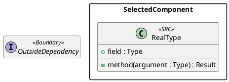

# 架构内的局部类细节规范

## 层次与范围

- 架构页承担全局组件、职责、接口、技术与依赖总览。禁止生成或维护全仓库类图。
- 用户先选择 1–3 个组件，再查看局部源码类细节。组件 ID 与具体架构版本必须固定；0 表示当前源码结构，正整数表示指定设计架构版本。
- 只能读取这些组件明确列出的 source_refs。范围过大时让用户选取其中 1–12 个文件；不得递归目录、追踪导入或读取范围外依赖来补全图。
- 每张图最多 24 个类/类型、每类 32 个成员、总计 160 个成员、24 个简化边界。超过限制必须要求缩小范围，不得先绘制全图再在前端隐藏。
- 未映射到源码的设计组件只能显示 DESIGN 与说明，不得虚构源码类。模块级函数也不得冒充真实类。
- 范围外依赖只显示没有成员的 Boundary 接口节点。直接架构邻居与导入依赖应分别标明依据。

## 源码与设计

- 原始类、字段、方法签名和真实继承均须由实际源码证明。保留源码标识，不翻译代码名称。
- Python 使用 AST，C++、TypeScript、Vue 脚本使用语言解析器；不支持的语法或语言必须明确披露。
- 标记 SRC 的内容只是静态源码依据，不代表行为已经验收。
- 设计版架构中的映射文件可提供 SRC 类细节，但架构连线仍是 DESIGN，不能混淆成已经实现。
- 手工维护的局部设计图使用 origin=design；源码加设计使用 mixed，并用 design_elements 列出每个待实现的 PlantUML 实体别名或 Alias::member。
- 提议的关系也必须标记 DESIGN。已实现元素经源码确认后移除标记，保留尚未实现设计与历史版本。
- 类图是可选细节，不阻塞架构维护、里程碑更新、迁移或验收。

## 成员与关系

- 字段保留真实名称和类型；签名保留参数、类型、返回类型、async 和公开/私有标识。
- 不复制秘密值或不必要的字面量默认值。只展示静态声明，不推测动态成员、调用链或运行时行为。
- 实际类型如 class、struct、interface、enum 可用 stereotype 区分，不能捏造类。
- 只对确定的真实继承使用 Extend；仅有导入依据时用 Import，不把依赖推断为 Invoke。
- 用户明确要求手工补充局部设计时，使用明确的 Use、Create、Persist、Handoff、Dispatch、Inject、Contain 等关系标签，并区分事实和提案。
- 中文 note 解释局部约束或限制，必要时绑定具体成员；不得用泛泛职责掩盖没有证据的推断。

## 布局与保存

使用以下基本样式：

```plantuml
@startuml
skinparam packageStyle rectangle
skinparam linetype polyline
hide empty members
' Commit: <baseline commit>
' Scope: <selected components and files>
package SelectedComponent {
    class RealType <<SRC>> {
        + field : Type
        + method(argument : Type) : Result
    }
}
interface OutsideDependency <<Boundary>>
@enduml
```

- 不依赖颜色表达 SRC / DESIGN / Boundary，导出图片也要有文字标记。
- 新局部图必须保存 component_ids、architecture_revision 与稳定的范围 ID，不使用 class_model。
- 保存前检查文件映射、逐文件基线、大小限制与 PlantUML 编译。源码在渲染期间变化也要拒绝过期结果。
- 历史全局 class_model 仅保留归档，不再渲染；不能破坏既有架构版本、证据、迁移和里程碑。
- 禁止 include、预处理宏、超链接、嵌入图片或远程资源。
